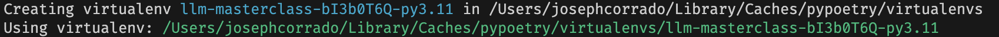

# Weeks 4 & 5 - Natural Language Processing

## Dev Setup

First, you need to make sure you have some version of Python installed on your machine.

Then, you need to make sure that you have poetry installed on your machine.

You can find the poetry installation instructions [here](https://python-poetry.org/docs/).

Then, you can instruct poetry to use the system version of Python with (if you're on Mac or Linux):

```bash
poetry env use $(which python)
```

If you're on Windows, you have to find the path to the currently active Python with:

```bash
gcm python
```

Then, copy that path into:

```bash
poetry env use $(<path-to-python>)
```

Remember to remove the `<` and `>` when you paste in the path to your Python executable.

After running the `poetry env use` command, you should see something that looks like:



Then, to install all the dependencies from the `pyproject.toml`, you run:

```bash
poetry install
```