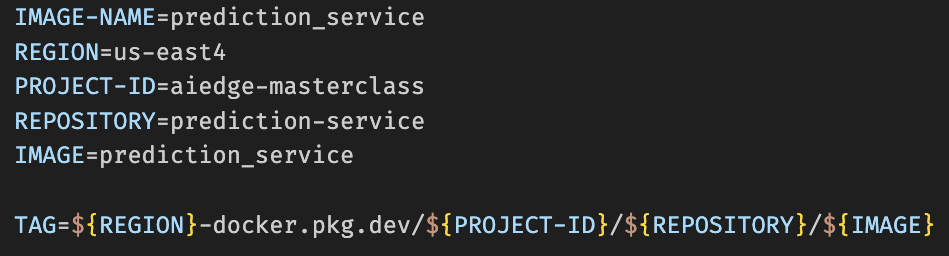

# Model Deployment

## Train Model

First, we need to fit an actual machine learning model to deploy.

In our case, we are going to use the Iris dataset, with a basic scikit-learn model.

To train the model, run:

```bash
python train_model.py
```

This will create a model artifact `model.joblib` inside the root directory of the repo.

## Prediction Service

Now that we have a fitted model, we have to expose that model through a service to make predictions.

We are going to use FastAPI to do that in this course.

To start up the FastAPI server locally, you can run:

```bash
make prediction_service
```

This will spawn a service listening for requests on `localhost:8000`.
When you navigate to that URL in your browser, you should get back the "Hello World!" message.

Next, FastAPI will automatically generate documentation for us based on our code and pydantic models. You just need to go to the `/docs` endpoint. So if you navigate to `localhost:8000/docs`, you should see the hello world GET endpoint, and the predict POST endpoint.

For the predict POST endpoint, you can try an example request. In this case, our pydantic model tells FastAPI that we're listening for requests with 4 query parameters - one for each of the features needed for our Iris model.

## Containerizing the Prediction Service

Now we'll look into containerizing the prediction service we just created.

First, we need to build the docker image.

We can use the Makefile in the repo to do that:

```bash
make image
```

This runs the command:

```bash
docker build -t prediction_service .
```

This will build a docker image that's tagged with the name `prediction_service`.

You can verify that it has been built by running:

```bash
docker images
```

And you should see a docker image there in your images, with the name `prediction_service`.

Then, we need to run a docker container process based on that image.

To do that, we also have a Makefile endpoint we can use:

```bash
make prediction_service_container
```

This runs a Docker container process with the name `prediction_service`.

This container will expose the port 8000, so that you should access the same endpoint as we did before, when we ran the FastAPI server directly.

You can verify that your docker container is running by running:

```bash
docker ps -a
```

You should see a container by the name of `prediction_service`.

Then, when you want to stop the container, you can run:

```bash
docker stop prediction_service
```

However, you should notice that your container won't be removed, but it'll now have the `EXITED` status.

## Pushing Docker Image to Artifact Registry

First, go into your Google Console, and then go to Artifact Registry.

Create a new repository for the prediction service. Note down:

* the name you used
* the region you created it in
* the project ID you're working in

You need to edit the values in the `Makefile`:

* `IMAGE`
* `REGION`
* `PROJECT-ID`

Then, you need to build the image. We can use the Makefile to do so.

```bash
make image
```

This command will produce a docker image by the name of `prediction_service`.

To verify that you've built the image, you can run:

```bash
docker images
```

You should find an image with a tag having a value equal to the value for `TAG` in the `Makefile`:



For your own GCP projects, regions, and repository name, you should edit the values for these variables.

Then, you push the image to the artifact repository you created, referencing the image we built by its tag:

```bash
make push
```
