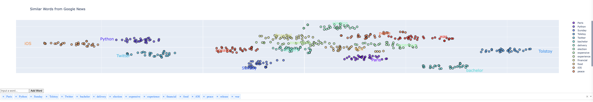

# Weeks 4 & 5 - Large Language Models

The first ML project we'll be developing in the LLM section is a word similarity machine.

The second project will be to create a system for predicting sentiment analysis, given a sentence.

## Project 1 - Word Similarity

For this week, we'll go through the process of creating a word similarity machine. This is a system that can take two words and determine how similar they are. For example, the words "cat" and "dog" are very similar, while the words "cat" and "banana" are not.

We will create a Python Dash plotly dashboard for displaying the word clouds of dimensionally reduced t-SNE word embeddings.



This dashboard allows you to add additional words, and then it re-computes the t-SNE embeddings for those words, and displays them to the user.

First, make sure you have Python installed on your system. Then to set up this project, you will `cd` into the `2_large_language_models` directory and run the following command:

```bash
poetry env use $(which python)
poetry install
```

And to launch the dashboard, you need to go into the `ml_project_1_similar_words` directory and run:

```bash
make up
```

Note that it will take some time to download the pre-trained Google News Word2Vec model. In addition, it takes about 20 seconds to load the model into memory on every startup, and a few seconds to re-compute the embeddings every time.
