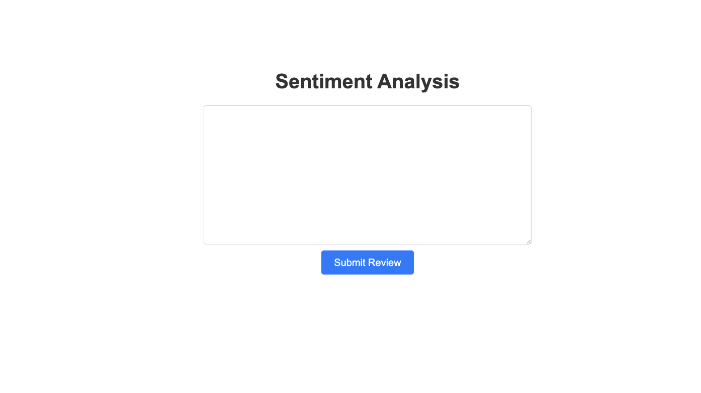

# Full Stack Sentiment Analysis Application

This app is a very basic implementation of an application that can take in reviews from the user, send those reviews to an LLM hosted on GCP VertexAI,
and then make a prediction as to whether the sentiment of that review is positive or negative.

There are two main components to this app:

* the Python-based FastAPI backend service
* the Svelte (JavaScript)-based frontend client (service)

The frontend for the app looks like this:



## GCP Instructions

The instructions for building the connection between Bigquery and VertexAI hosted models can be found [at this link](https://cloud.google.com/bigquery/docs/generate-text-tutorial).

At a high level, they consist of:

1. go into Bigquery, and create a dataset to store the ML model
    * you have to give it a dataset ID, give it a location type of multi-region and select the US region
2. create a connection:
    * click on the `+` next to `Add data`, and select `Connections to external data sources`
    * for Connection type, select `BigLake and remote functions (Cloud Resource)` - this is how you specify that you want to connect to a VertexAI model
    * for Connection ID, enter a name for the connection
3. add the role to access VertexAI to the service account for the connection object:
    * go to IAM, then click on `+ Add`, then hit `Add principals`
    * enter the service account ID from the connection you created in the previous step
    * in the `Select a role` field, select `Vertex AI`, and click on `Vertex AI User role`
4. create a model:
    * run the Bigquery query:

```sql
CREATE OR REPLACE MODEL bqml_tutorial.llm_model
REMOTE WITH CONNECTION `LOCATION.CONNECTION_NAME`
OPTIONS (remote_service_type = 'CLOUD_AI_LARGE_LANGUAGE_MODEL_V1');
```

Now the FastAPI backend should be able to run the queries against the model you've created a connection to.
