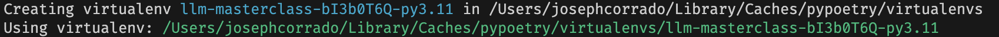

# ML Masterclass

This is the course repo for the AI Masterclass.

The structure of the repo consists of a directory for each section. Each section contains multiple directories for the hands-on projects:

* `0_introduction_to_tensorflow` (Week 1)
* `1_model_deployment` (Week 1)
* `2_large_language_models` (Weeks 4 & 5)
* `3_computer_vision` (Weeks 6 & 7)

Each directory contains the poetry configuration, Jupyter notebooks and application code to run all the examples given in the lectures, TA sessions, and the deployed applications for each section.

## Tech Stack

For this course, we'll be using the tools:

* `poetry`
* `TensorFlow`
* `GCP`

## Dev Setup

### Poetry Installation

First, make sure you have some version of Python installed on your machine. I usually do this using conda virtual environments to isolate my versions of Python.

To install `poetry`, on Mac you can just go:

```bash
brew install poetry
```

If you're using Windows or Linux, you should follow the instructions [here](https://python-poetry.org/docs/).

### Create Poetry Virtual Environments

For each directory that has a `pyproject.toml` file, it will get its own Poetry virtual environment. You `cd` into each directory, and create a particular virtual environment that's specific to that subdirectory.

After you've `cd`'d into a directory containing a `pyproject.toml` file, you tell poetry to construct a virtual environment using the currently active version of Python with:

```bash
poetry env use $(which python)
```

If you're on Windows, you have to find the path to the currently active Python with:

```bash
gcm python
```

Then, copy that path into:

```bash
poetry env use <path-to-python>
```

Remember to remove the `<` and `>` when you paste in the path to your Python executable.

After running the `poetry env use` command, you should see something that looks like:



Then, to install all the dependencies from the `pyproject.toml`, you run:

```bash
poetry install
```
